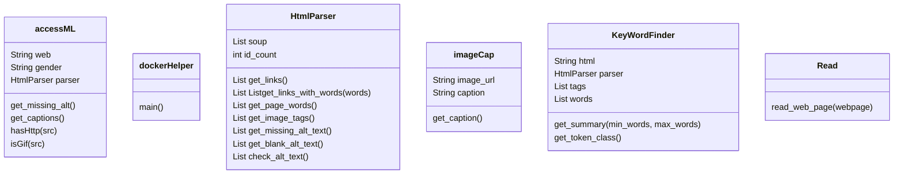

# Requirements
The following were installed and required for operation
- [rootless docker](https://docs.docker.com/engine/security/rootless/)
- CUDA 12 but specifically with [NVIDIA container toolkit](https://docs.docker.com/engine/security/rootless/)

# Build
In the cmds folder run  
    docker build -t tensor-image . -f tensor-image  

Then you can interact with the docker as needed, note that in code the docker is ran via a python subprocess so it may be wise to minimize interaction with existing files to prevent integrity issues. If they do occur a fresh docker build should fix the issue.  
    docker run tensor-image cmd  

For GPU access you require the following options added to the docker run  
    docker run --runtime=nvidia --gpus all(or number) Tensor-Image <command here>  

The torch-image is a clone of the tensor-image but has pytorch installed instead. We had tried to convert a pytorch model for determining decorative/aethestic images vs non. We made the image as a last effort.  

# Classes

